# Class diagram

Generated by `node server/scripts/class-diagram.mjs`. Do not hand-edit.

Arrows are constructor dependencies: `A --> B` means A is given a B.

```mermaid
classDiagram
  namespace unlayered {
    class ReviewExcerpt {
      <<interface>>
    }
    class ReviewResult {
      <<interface>>
    }
    class AmazonProduct {
      <<interface>>
    }
    class ActorRunner {
      <<interface>>
      run()
    }
    class ApifyActorRunner {
      run()
    }
    class App {
      <<interface>>
      close()
    }
    class TokenService {
      issue()
      verify()
    }
    class Rates {
      <<interface>>
    }
    class Pricing {
      <<interface>>
    }
    class Billed {
      <<interface>>
    }
    class OpenRouterCosts {
      start()
      refreshPrices()
      price()
      generationCost()
      stop()
    }
    class RunBilling {
      track()
      settle()
    }
    class PacketError {
    }
    class RunError {
    }
    class EventFrame {
      <<interface>>
    }
    class Live {
      <<interface>>
    }
    class RetryPolicy {
      <<interface>>
    }
    class RunSupervisor {
      start()
      recoverRunsKilledByRestart()
      steer()
      stop()
      close()
      subscribe()
      isLive()
      waitFor()
    }
    class ResearchRun {
      <<interface>>
    }
    class RunSummary {
      <<interface>>
    }
    class RunEvent {
      <<interface>>
    }
    class Judgement {
      <<interface>>
    }
    class PacketCheck {
      <<interface>>
    }
    class RunUpdate {
      <<interface>>
    }
    class LlmCallRecord {
      <<interface>>
    }
    class LlmCall {
      <<interface>>
    }
    class ResearchStore {
      <<interface>>
      createRun()
      getRun()
      listRuns()
      updateRun()
      addEvent()
      listEvents()
      listJudgements()
      addJudgement()
    }
    class SqliteResearchStore {
      createRun()
      getRun()
      listRuns()
      updateRun()
      addEvent()
      listEvents()
      listJudgements()
      addJudgement()
    }
    class SearchHit {
      <<interface>>
    }
    class FetchRecord {
      <<interface>>
    }
    class PacketCheckOptions {
      <<interface>>
    }
  }
  namespace domain {
    class Briefs {
      looksLikeUrl()
      normalise()
      key()
    }
    class Stages {
      of()
      covering()
      expand()
      isPartial()
    }
  }
  namespace config {
    class Settings {
      <<interface>>
    }
    class Env {
      text()
      number()
      flag()
      settings()
    }
  }
  RunBilling --> OpenRouterCosts
```

## Inventory

| Layer | Module | Classes |
|---|---|---|
| `(unlayered)` | `apify.ts` | ReviewExcerpt, ReviewResult, AmazonProduct, ActorRunner, ApifyActorRunner |
| `(unlayered)` | `app.ts` | App |
| `(unlayered)` | `auth.ts` | TokenService |
| `config` | `config/settings.ts` | Settings, Env |
| `(unlayered)` | `costs.ts` | Rates, Pricing, Billed, OpenRouterCosts, RunBilling |
| `domain` | `domain/brief.ts` | Briefs |
| `domain` | `domain/nodes.ts` | Stages |
| `(unlayered)` | `packet.ts` | PacketError |
| `(unlayered)` | `runner.ts` | RunError, EventFrame, Live, RetryPolicy, RunSupervisor |
| `(unlayered)` | `store.ts` | ResearchRun, RunSummary, RunEvent, Judgement, PacketCheck, RunUpdate, LlmCallRecord, LlmCall, ResearchStore, SqliteResearchStore |
| `(unlayered)` | `tools.ts` | SearchHit, FetchRecord, PacketCheckOptions |
