# Class diagram

Generated by `node server/scripts/class-diagram.mjs`. Do not hand-edit.

Arrows are constructor dependencies: `A --> B` means A is given a B.

```mermaid
classDiagram
  namespace domain {
    class Briefs {
      looksLikeUrl()
      normalise()
      key()
    }
    class RunEvent {
      <<interface>>
    }
    class Judgement {
      <<interface>>
    }
    class PacketCheck {
      <<interface>>
    }
    class RunUpdate {
      <<interface>>
    }
    class LlmCallRecord {
      <<interface>>
    }
    class LlmCall {
      <<interface>>
    }
    class Stages {
      of()
      covering()
      expand()
      isPartial()
    }
    class ResearchStore {
      <<interface>>
      createRun()
      getRun()
      listRuns()
      updateRun()
      addEvent()
      listEvents()
      listJudgements()
      addJudgement()
    }
    class Clock {
      nowIso()
    }
    class Ids {
      next()
    }
    class ResearchRun {
      <<interface>>
    }
    class RunSummary {
      <<interface>>
    }
    class Runs {
      summary()
    }
    class RejectKinds {
      effective()
    }
  }
  namespace config {
    class Settings {
      <<interface>>
    }
    class Env {
      text()
      number()
      flag()
      settings()
    }
  }
  namespace extract {
    class JsonBlocks {
      fenced()
      balanced()
    }
    class PacketExtractor {
      extract()
    }
    class BriefCheck {
      problems()
    }
    class PacketContext {
      <<interface>>
    }
    class PacketCheck {
      <<interface>>
      problems()
    }
    class CitationCheck {
      problems()
    }
    class CompetitorCheck {
      problems()
    }
    class CompletenessCheck {
      problems()
    }
    class PacketDraft {
      coerce()
    }
    class PacketError {
    }
    class Names {
      normalise()
      squash()
      sameHost()
    }
    class BrandLabels {
      of()
    }
    class Relations {
      expected()
    }
    class ScopeCheck {
      problems()
    }
    class ZodProblems {
      readable()
    }
    class PacketValidator {
      validate()
      parse()
    }
  }
  namespace adapters {
    class Spend {
      capFor()
    }
    class AmazonReviews {
      fetch()
    }
    class Field {
      text()
      numberOrNull()
    }
    class AmazonProducts {
      find()
    }
    class ActorRunner {
      <<interface>>
      run()
    }
    class ApifyActorRunner {
      run()
    }
    class ActorRunners {
      forSettings()
    }
    class TrustpilotReviews {
      fetch()
    }
    class ReviewExcerpt {
      <<interface>>
    }
    class ReviewResult {
      <<interface>>
    }
    class AmazonProduct {
      <<interface>>
    }
    class Corpus {
      write()
    }
    class Firecrawl {
      scrape()
    }
    class Http {
      withTimeout()
      pool()
    }
    class OpenRouterPrices {
      start()
      refreshPrices()
      ratesFor()
      generationCost()
      stop()
    }
    class Rates {
      <<interface>>
    }
    class Pricing {
      <<interface>>
    }
    class Billed {
      <<interface>>
    }
    class Money {
      perMillion()
      rates()
    }
    class RunBilling {
      track()
      settle()
    }
    class SearchHit {
      <<interface>>
    }
    class Searxng {
      find()
    }
    class CallLog {
      add()
      setBilled()
      list()
    }
    class PacketCheckLog {
      add()
      list()
    }
    class EventLog {
      add()
      list()
    }
    class JudgementTable {
      list()
      add()
      delete()
      bump()
    }
    class Rows {
      json()
      run()
    }
    class RunTable {
      create()
      get()
      list()
      update()
    }
    class SqliteSchema {
      apply()
    }
    class SqliteResearchStore {
      createRun()
      getRun()
      listRuns()
      updateRun()
      addEvent()
      listEvents()
      listJudgements()
      addJudgement()
    }
  }
  namespace agent {
    class BilledCosts {
    }
    class RunError {
    }
    class TurnEnd {
      <<interface>>
    }
    class AgentEventRecorder {
      record()
      text()
    }
    class EventFrame {
      <<interface>>
    }
    class Frames {
      toolPreview()
      callSummary()
    }
    class Live {
      <<interface>>
    }
    class LiveRuns {
      add()
      remove()
      get()
      ids()
      abortAll()
      drain()
      has()
      waitFor()
    }
    class LlmCallLog {
      wrap()
    }
    class ModelPricing {
      apply()
    }
    class PromptBlocks {
      code()
      nodes()
      gapNodes()
      scope()
      judgements()
      brief()
    }
    class PromptBuilder {
      system()
      instructions()
    }
    class WorkedExample {
      forStage()
    }
    class AgentMessages {
      steer()
      packetNudge()
      resume()
    }
    class RetryPolicy {
      <<interface>>
    }
    class Retries {
      isRetryable()
      backoffMs()
      sleep()
    }
    class RunAgentFactory {
      assemble()
    }
    class RunSettlement {
      keepValidated()
      hasValidated()
      settle()
    }
    class RunSupervisor {
      start()
      recoverRunsKilledByRestart()
      steer()
      stop()
      close()
    }
    class RunWatch {
      run()
    }
    class ToolsetOptions {
      <<interface>>
    }
    class ResearchToolset {
      build()
    }
    class FetchRecord {
      <<interface>>
    }
    class PacketCheckOptions {
      <<interface>>
    }
    class PacketCheckTool {
      tool()
    }
    class ReviewRendering {
      limit()
      cappedNote()
      starBand()
      locator()
      render()
    }
    class FindProductTool {
      tool()
    }
    class AmazonReviewsTool {
      tool()
    }
    class TrustpilotReviewsTool {
      tool()
    }
    class WebSearchTool {
      tool()
    }
    class WebFetchTool {
      tool()
    }
    class UsageTotals {
      empty()
      add()
    }
  }
  namespace http {
    class App {
      close()
    }
    class AuthGate {
      register()
    }
    class CallStats {
      of()
    }
    class ConfigRoute {
      register()
    }
    class CorpusRoute {
      register()
    }
    class EventStream {
      register()
    }
    class Frontend {
      mount()
    }
    class JudgementRoutes {
      register()
    }
    class Passwords {
      hash()
      verify()
    }
    class ResearchApi {
      router()
    }
    class RunRoutes {
      register()
    }
    class TokenService {
      issue()
      verify()
    }
  }
  AmazonReviews --> ActorRunner
  AmazonProducts --> ActorRunner
  TrustpilotReviews --> ActorRunner
  Firecrawl --> Settings
  RunBilling --> OpenRouterPrices
  Searxng --> Settings
  BilledCosts --> ResearchStore
  BilledCosts --> LiveRuns
  AgentEventRecorder --> LiveRuns
  LiveRuns --> ResearchStore
  ModelPricing --> OpenRouterPrices
  RunAgentFactory --> Settings
  RunAgentFactory --> ResearchStore
  RunAgentFactory --> LiveRuns
  RunAgentFactory --> OpenRouterPrices
  RunAgentFactory --> RetryPolicy
  RunAgentFactory --> PromptBuilder
  RunSettlement --> ResearchStore
  RunSettlement --> LiveRuns
  ResearchToolset --> ToolsetOptions
  PacketCheckTool --> PacketCheckOptions
  FindProductTool --> AmazonProducts
  AmazonReviewsTool --> Settings
  AmazonReviewsTool --> AmazonReviews
  TrustpilotReviewsTool --> Settings
  TrustpilotReviewsTool --> TrustpilotReviews
  WebSearchTool --> Searxng
  WebFetchTool --> Settings
  WebFetchTool --> Firecrawl
  WebFetchTool --> Corpus
  AuthGate --> Settings
  ConfigRoute --> Settings
  CorpusRoute --> ResearchStore
  CorpusRoute --> Settings
  EventStream --> ResearchStore
  EventStream --> RunSupervisor
  JudgementRoutes --> ResearchStore
  RunRoutes --> ResearchStore
  RunRoutes --> RunSupervisor
```

## Inventory

| Layer | Module | Classes |
|---|---|---|
| `adapters` | `adapters/apify/actors.ts` | Spend |
| `adapters` | `adapters/apify/amazon-reviews.ts` | AmazonReviews |
| `adapters` | `adapters/apify/fields.ts` | Field |
| `adapters` | `adapters/apify/products.ts` | AmazonProducts |
| `adapters` | `adapters/apify/runner.ts` | ActorRunner, ApifyActorRunner, ActorRunners |
| `adapters` | `adapters/apify/trustpilot-reviews.ts` | TrustpilotReviews |
| `adapters` | `adapters/apify/types.ts` | ReviewExcerpt, ReviewResult, AmazonProduct |
| `adapters` | `adapters/corpus.ts` | Corpus |
| `adapters` | `adapters/firecrawl.ts` | Firecrawl |
| `adapters` | `adapters/http.ts` | Http |
| `adapters` | `adapters/openrouter-prices.ts` | OpenRouterPrices |
| `adapters` | `adapters/rates.ts` | Rates, Pricing, Billed, Money |
| `adapters` | `adapters/run-billing.ts` | RunBilling |
| `adapters` | `adapters/searxng.ts` | SearchHit, Searxng |
| `adapters` | `adapters/sqlite/call-log.ts` | CallLog |
| `adapters` | `adapters/sqlite/check-log.ts` | PacketCheckLog |
| `adapters` | `adapters/sqlite/event-log.ts` | EventLog |
| `adapters` | `adapters/sqlite/judgement-table.ts` | JudgementTable |
| `adapters` | `adapters/sqlite/rows.ts` | Rows |
| `adapters` | `adapters/sqlite/run-table.ts` | RunTable |
| `adapters` | `adapters/sqlite/schema.ts` | SqliteSchema |
| `adapters` | `adapters/sqlite/store.ts` | SqliteResearchStore |
| `agent` | `agent/billed-costs.ts` | BilledCosts |
| `agent` | `agent/errors.ts` | RunError |
| `agent` | `agent/event-recorder.ts` | TurnEnd, AgentEventRecorder |
| `agent` | `agent/frames.ts` | EventFrame, Frames |
| `agent` | `agent/live-runs.ts` | Live, LiveRuns |
| `agent` | `agent/llm-call-log.ts` | LlmCallLog |
| `agent` | `agent/pricing.ts` | ModelPricing |
| `agent` | `agent/prompt/blocks.ts` | PromptBlocks |
| `agent` | `agent/prompt/builder.ts` | PromptBuilder |
| `agent` | `agent/prompt/example-picker.ts` | WorkedExample |
| `agent` | `agent/prompt/messages.ts` | AgentMessages |
| `agent` | `agent/retry.ts` | RetryPolicy, Retries |
| `agent` | `agent/run-agent-factory.ts` | RunAgentFactory |
| `agent` | `agent/run-settlement.ts` | RunSettlement |
| `agent` | `agent/run-supervisor.ts` | RunSupervisor |
| `agent` | `agent/run-watch.ts` | RunWatch |
| `agent` | `agent/tools/factory.ts` | ToolsetOptions, ResearchToolset |
| `agent` | `agent/tools/lanes.ts` | FetchRecord, PacketCheckOptions |
| `agent` | `agent/tools/packet-check-tool.ts` | PacketCheckTool |
| `agent` | `agent/tools/review-rendering.ts` | ReviewRendering |
| `agent` | `agent/tools/review-tools.ts` | FindProductTool, AmazonReviewsTool, TrustpilotReviewsTool |
| `agent` | `agent/tools/web-tools.ts` | WebSearchTool, WebFetchTool |
| `agent` | `agent/usage.ts` | UsageTotals |
| `config` | `config/settings.ts` | Settings, Env |
| `domain` | `domain/brief.ts` | Briefs |
| `domain` | `domain/logs.ts` | RunEvent, Judgement, PacketCheck, RunUpdate, LlmCallRecord, LlmCall |
| `domain` | `domain/nodes.ts` | Stages |
| `domain` | `domain/ports.ts` | ResearchStore |
| `domain` | `domain/records.ts` | Clock, Ids, ResearchRun, RunSummary, Runs |
| `domain` | `domain/reject-kinds.ts` | RejectKinds |
| `extract` | `extract/blocks.ts` | JsonBlocks, PacketExtractor |
| `extract` | `extract/brief-check.ts` | BriefCheck |
| `extract` | `extract/check.ts` | PacketContext, PacketCheck |
| `extract` | `extract/citation-check.ts` | CitationCheck |
| `extract` | `extract/competitor-check.ts` | CompetitorCheck |
| `extract` | `extract/completeness-check.ts` | CompletenessCheck |
| `extract` | `extract/draft.ts` | PacketDraft |
| `extract` | `extract/errors.ts` | PacketError |
| `extract` | `extract/names.ts` | Names, BrandLabels, Relations |
| `extract` | `extract/scope-check.ts` | ScopeCheck |
| `extract` | `extract/validator.ts` | ZodProblems, PacketValidator |
| `http` | `http/app.ts` | App |
| `http` | `http/auth-gate.ts` | AuthGate |
| `http` | `http/call-stats.ts` | CallStats |
| `http` | `http/config-route.ts` | ConfigRoute |
| `http` | `http/corpus-route.ts` | CorpusRoute |
| `http` | `http/event-stream.ts` | EventStream |
| `http` | `http/frontend.ts` | Frontend |
| `http` | `http/judgement-routes.ts` | JudgementRoutes |
| `http` | `http/passwords.ts` | Passwords |
| `http` | `http/research-api.ts` | ResearchApi |
| `http` | `http/run-routes.ts` | RunRoutes |
| `http` | `http/token-service.ts` | TokenService |
